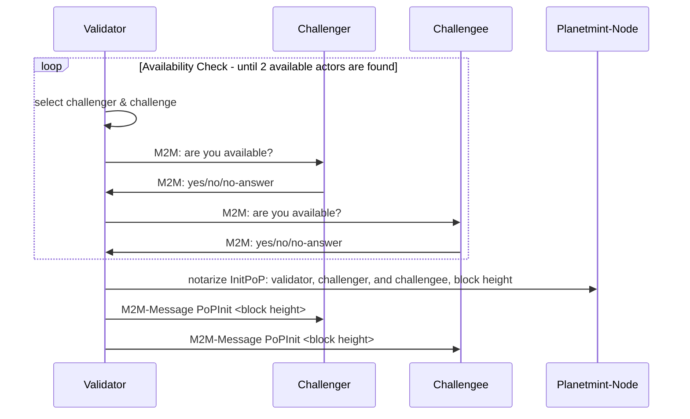
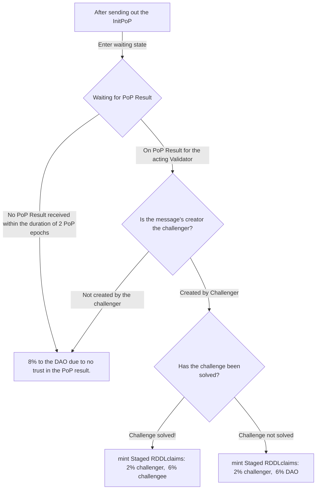

```
shortname: REP-11
name: Proof of Productivity (PoP)
type: standard
status: Stable
editor: Jürgen Eckel juergen@riddleandcode.com
contributors:
```

## **Abstract**
The Proof of Productivity is periodically executed, and its result (negative or positive) leads to and influences the reward distribution based on a multi-sig token re-issuance process on liquid.

> Under the assumption that a single point of notarized data (CID) exposes and thus discloses no relevant information, PoP can be viewed and interpreted as a multi-round zero-knowledge proof. 


## **Motivation**
 The goal of this REP is to describe the structure and concept of the PoP. 


## **Problem Breakdown**
RDDL network wants to enable the notarization of 
* data
* productivity
* energy usage/consumption

and prove 

* origin and provenance
* integrity and authenticity

of data.

The machines notarize their activities and make their productivity transparent. RDDL network verifies the notarized claims of the devices with the help of the Proof of Productivity (PoP) - the challenge process of the network.
The PoP process establishes trust in the notarized data and verifies the availability of the data. The process implicitly proves provenance and integrity. 

## Proof of Productivity

The following stages of PoP exist:
* Actor Selection: The block-creating validator selects the PoP actors and initiates the PoP with the selected actors
* Challenge-Response: The challenger and challengee execute/perform the PoP.
* Rewards: The validators evaluate the notarized PoP Result and issue RDDL tokens as rewards.

### Actor Selection
The CometBFT consensus algorithm selects the acting validator. The algorithm selects Block creators for each epoch/block.

The thereby elected validator is the master of ceremony for this very execution of the PoP and performs the following actions
1. selects a challenger and a challengee
2. verifies their availability via m2m (mqtt)
3. notarizes the selection via an InitPoP message containing
   * the validator-address,
   * challenger address
   * challengee address
   * block height
4. sends a PopInit command containing the block height of the PoP to the challenger and the challengee with the expectation that both will perform the PoP.



### Challenge-Response
PoP attests to two facts. That the machine actively consumed or produced energy and that the machine can prove data availability and integrity as stated by its CID notarization.

At the end of an epoch (2 min), the proposing Validator initiates the PoP-related challenge response by sending MQTT messages to the challenger and the challengee (see paragraph).

The initialized challenge-response process is described below:

1. Challenger and challengee request the details of the PoP by calling  [/planetmint/dao/challenge/{height}](https://testnet-api.rddl.io/#/Query/PlanetmintgoDaoGetChallenge).
2. The challenger selects a random CID from a list of CIDs for a certain period of time provided by calling [/planetmint/asset/address/{address}/{lookupPeriodInMin}](https://testnet-api.rddl.io/#/Query/PlanetmintgoAssetGetCIDsByAddress).
3. The challenger subscribes to the PoPChallengeResult-topic of the challangee (stat/<challangee-address>/POPCHALLENGERESULT).
4. The challenger sends the cmnd/<challangee-address>/PoPChallenge <CID> command to the challengee.
5. The challengee looks up the corresponding CID data and transfers it to the challenger via the POPCHALLENGERESULTcommand.
6. The challenger receives the data via the subscribed topic and computes the CID' of the provided content. 
7. The challenger notarizes a ReportPopResult message with Success = true if the computed CID' equals the requested CID and Success = false, otherwise.
8. The challenger unsubscribes from stat/<challangee-address>/POPCHALLENGERESULT.
​
```mermaid
sequenceDiagram
participant Validator
participant Challenger
participant Challengee
Participant Plflowchart TD
    X[After sending out the InitPoP]--> |Enter waiting state| Y
    Y{Waiting for PoP Result}-->|No PoP Result received within the duration of 2 PoP epochs| J
    Y-->|On PoP Result for the acting Validator| B{Is the message's creator the challenger?}
    B -->|Created by Challenger| C{\n Has the challenge been solved?}
    C -->|Challenge solved!| D[mint Staged RDDLclaims: 2% challenger,  6% challengee]

    B -->|Not created by the challenger| J[8% to the DAO due to no trust in the PoP result.]
    C -->|Challenge not solved| E[mint Staged RDDLclaims: 2% challenger,  6% DAO]
anetmint-Node

Validator->>Challenger: M2M: request to perform the challenge (PopInit <block height>)
Validator->>Challengee: M2M: request to perform the challenge (PopInit <block height>)

Challenger->>Planetmint-Node: lookup PoPInit <block height> to get the challengee and the block-height
Challengee->>Planetmint-Node: lookup PoPInit <block height> to get the challengeer and the block-height


loop Select CID
Challenger->>Planetmint-Node: request notarized CIDs of the Challengee for last month
Planetmint-Node->>Challenger: return notarized CIDs TXs of the challengee
Challenger->>Challenger: select a random CID
end 

loop Challenge CID
Challenger->>Challenger: Subscribe to topic "stat/<challangee-address>/POPCHALLENGERESULT"
Challenger->>Challengee: send command "cmnd/<challangee-address>/PoPChallenge <CID>"
Challengee->>Challengee: lookup CID content from FS
Challengee->>Challengee: respond via stat/<challangee-address>/POPCHALLENGERESULT" CONTENT and requested CID
Challenger->>Challenger: compute CID` create_cid(CONTENT_I) and compare result to CID
Challenger->>Challenger: unsubscribe from "stat/<challangee-address>/POPCHALLENGERESULT"
end

Challenger->>Challenger: Create PoP Result: ReportPopResult with the challenge details.
Challenger->>Challenger: set Challenge.Success = (CID` == CID)
Challenger->>Planetmint-Node: notarize and broadcast PoP Result

```

### Rewards
The following paragraphs give an overview of how rewards are created and managed. The following stages are processed until someone can access their RDDL rewards:

* Reward Calculation
* Clearance Process: re-issuance & distribution

Before introducing these aspects, the generic staging and claiming of the rewards is addressed.

#### Staging the Rewards
RDDL tokens are issued as the final rewards of a PoP to a PoP-related multi-sig wallet(**PoP wallet**) on the Liquid network.

Rewarded PoP participants can claim their rewards from this wallet. Tokens to claim RDDL from the PoP-Wallet are minted once a day by a clearance process on Planetmint. The minted tokens representing claims are named **cRDDL** (claimable RDDL).

The block proposing validator verifying the ReportPoPResult message from the challenger mints **stagedCRDDL** following the reward calculation. The resulting stagedCRDDL tokens are converted to cRDDL by the clearance process.

> PLMNT and STAKE are the only tradable tokens on the Planetmint Chain. stagedCRDDL and cRDDL cannot be traded but redeemed as RDDL tokens on Liquid. RDDL of course is tradable on Liquid. 
> The configuration and voting proposal for this behaviour can be found at [voting-proposal.json](/data/REP-11/voting-proposal.json).


#### Claiming RDDLS
Details are to be defined. The claiming of RDDL will be issued by a Planetmint message. That message will burn cRDDL and transfer RDDL tokens from the PoP wallet to the specified Liquid address.

#### Reward Calculation
The network waits for the challenger to respond with the ReportPopResult for two PoP epochs (2 times 2 minutes). The rewards for the PoP are then calculated depending on the outcome of the PoP.



#### Clearance Process

Reducing transaction fees on Liquid is the purpose of the clearance process. The clearance process is executed once a day. It contains two steps: the re-issuance and distribution of the RDDL tokens to the DAO, PoP and investor wallets.
##### Re-issuance
Re-issuance is triggered periodically (once daily, configurable by the network) by the network. The block proposing validator iterates over all challenges since the last re-issuance and computes the number of tokens to be re-issued. 

The block proposer creates and broadcasts a ReissueRDDLProposal message. The network validates the message. The block proposer reissues the calculated tokens once the network confirms the message. Thereafter, the proposer also creates a ReissueRDDLResult message with the details about the reissuance.  

##### Distribution

The distribution of the re-issued tokens is set to 30 minutes (15 epochs) after the re-issuance. The block proposer initializes the distribution by issuing the DistributionRequest message. The network validates the message. The block proposer distributes the tokens following the proposal after the network confirms the message. Thereafter, the proposer creates a DistributionResult message with the corresponding transaction IDs and broadcasts the message to the network.